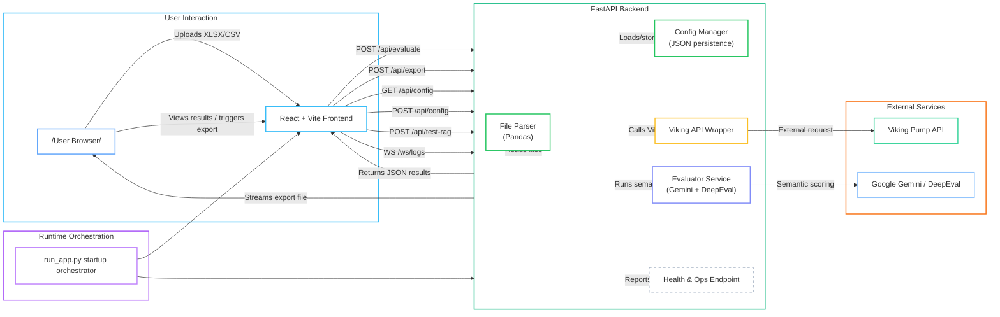

# Viking GenAI Automation Framework - Architecture

## Overview

The Viking GenAI Automation Framework is a full-stack application designed to automate the evaluation of AI prompts against the Viking Pump AI backend. It calculates match scores, generates judgment reasoning, and supports both document-based and RAG-based evaluation modes.

## Components

### 1. Frontend (React + Vite)

- **UI Theme:** Dark theme (Obsidian/Black background with white and green accent highlights).
- **Setup Tab:** Handles prompt file uploads (Excel/CSV), mode selection (Document vs. RAG), and runtime Viking configuration.
- **Results Tab:** Displays a results dashboard with prompt rows, AI responses, match scores, pass/fail status, analytics, and export controls.
- **Export Controls:** XLSX and PDF export buttons are styled with green background and black text for strong visual emphasis.
- **Live Feedback:** Real-time notifications and execution logs are streamed via WebSocket from the backend.
- **Settings Modal:** Manages persistent configuration for Viking, Gemini, and evaluation mapping.

### 2. Backend (FastAPI)

- **Main API:** Provides endpoints for evaluation, export, config persistence, health checks, and RAG connectivity tests.
- **Validation & Safety:** Ensures request payloads are validated, export formats are constrained, and RAG endpoints are verified before use.
- **Viking API Wrapper:** Handles session management, requests, and response streaming against the Viking Pump service.
- **Evaluator Service:** Uses Gemini via DeepEval to score and reason over AI outputs.
  - **Document Mode:** Compares AI response against expected output using semantic matching.
  - **RAG Mode:** Validates AI output against retrieved context and indexes.
- **Config Manager:** Persists settings safely to local JSON and protects config path handling.

### 3. Runtime Orchestration

- **Startup Script:** `run_app.py` orchestrates application launch in development, including dependency validation, frontend dependency install, port cleanup, and cross-platform process startup.
- **Process Control:** Uses explicit command arguments with `shell=False` to improve reliability and compatibility.

## Data Flow

1. User uploads a prompt file and optional expected response file in the **Setup Tab**.
2. User chooses **Document** or **RAG** mode and clicks **RUN**.
3. Frontend sends a multipart form request to `/api/evaluate`.
4. Backend processes the request:
   - Reads the uploaded file using Pandas.
   - Persists or loads runtime config through the Config Manager.
   - Creates a Viking session and sends prompts to the Viking API.
   - Receives AI responses and retrieval context.
   - Passes the data to the Evaluator Service for Gemini-based scoring.
5. Backend returns evaluation results to the frontend.
6. Frontend renders the report table, analytics dashboard, and export controls.

## Architecture Diagram

## Implemented Enhancements

- **Export UX:** XLSX and PDF exports use green background with black text for strong visual emphasis.
- **Backend Validation:** Added format validation, body validation, and safe export/export error handling.
- **RAG Checks:** Added explicit RAG endpoint validation with test connectivity support.
- **Live Logs:** WebSocket `/ws/logs` supports real-time execution telemetry on the frontend.
- **Startup Reliability:** `run_app.py` now checks and installs dependencies, cleans ports, and starts backend/frontend safely.
- **Config Safety:** Uses a robust local JSON config manager with path checks.

## Technology Stack

- **Frontend:** React, Tailwind CSS, Lucide Icons, Vite.
- **Backend:** FastAPI, Uvicorn, Pandas, DeepEval, Google Gemini.
- **Persistence:** Local JSON configuration storage.
- **Runtime Orchestration:** `run_app.py` for cross-platform startup.
- **Diagram:** `Guide/architect_diagram.mmd` contains the source Mermaid markup.
